# qutip-testing
Some random tests and visualizations that I've done in QuTiP while studying.

## Quantum Harmonic Oscillator Transition n=0 to n=3

Wigner function plots of the excitation due to the perturbation applied:
<i>|<i>
:---------------:|:---------------:
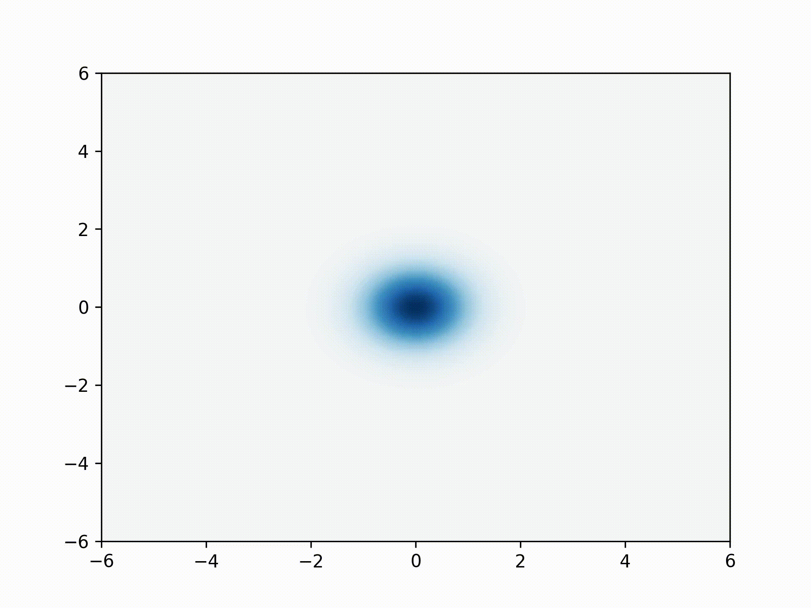|

 

## Wigner functions of Cat States and Mixed States of the Coherent State

For the coherent state

I plotted the Wigner function for the following cat and mixed states for alpha=3:

#### Cat states

<i>|<i>
:---------------:|:---------------:
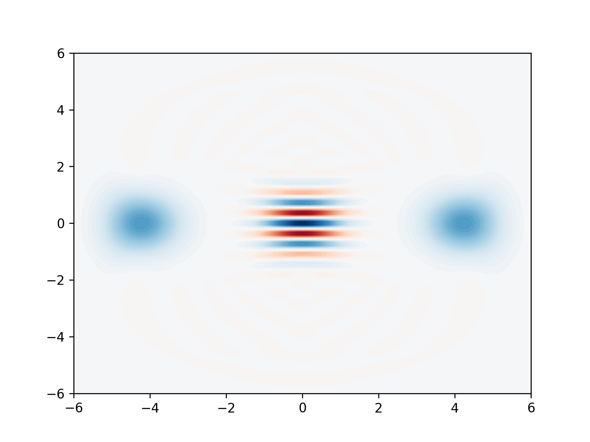|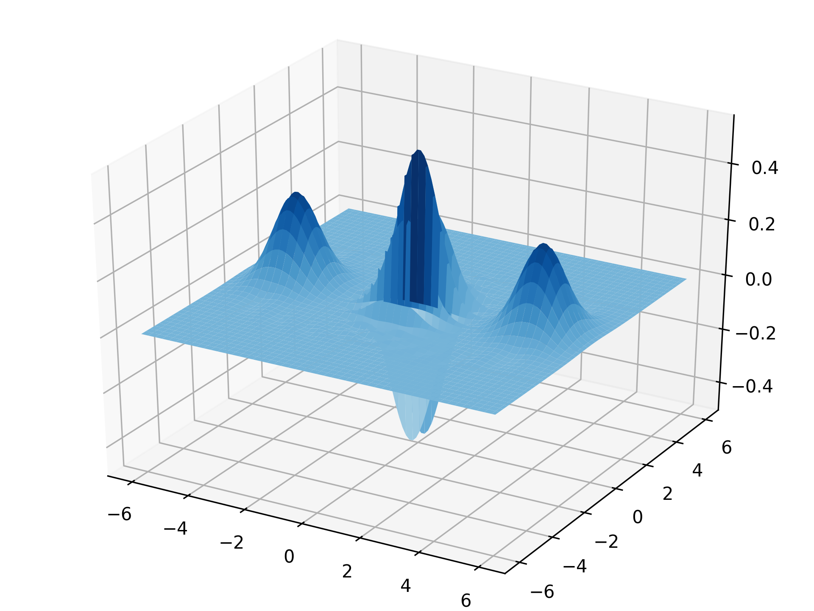

 

<i>|<i>
:---------------:|:---------------:
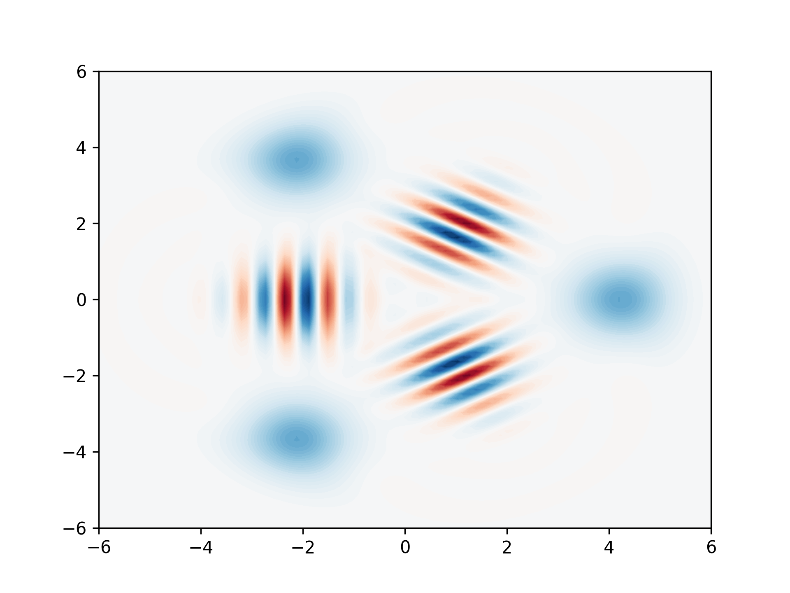|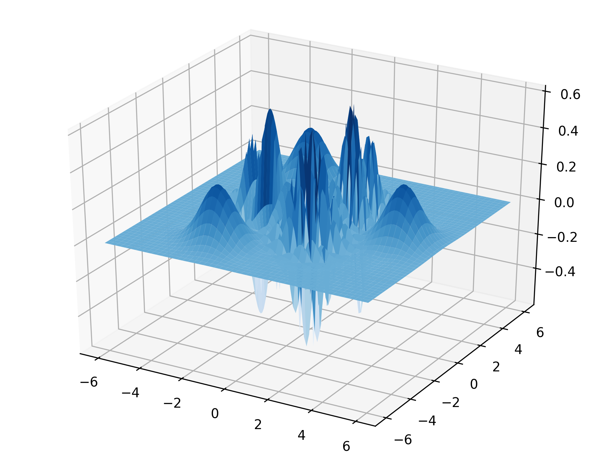

 

<i>|<i>
:---------------:|:---------------:
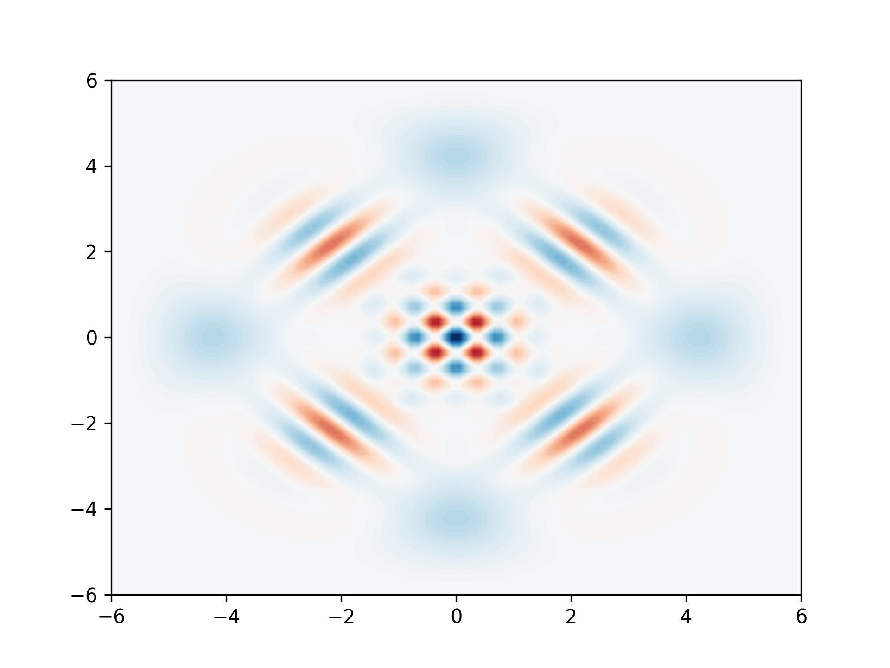|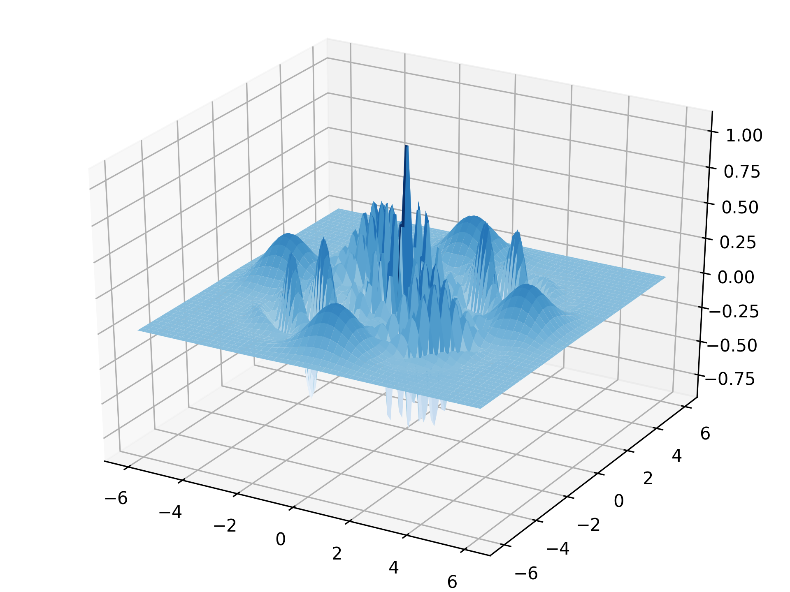

 

<i>|<i>
:---------------:|:---------------:
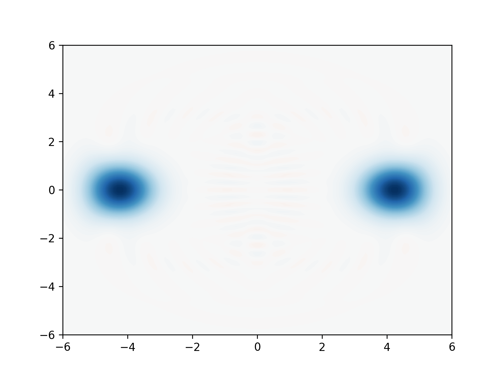|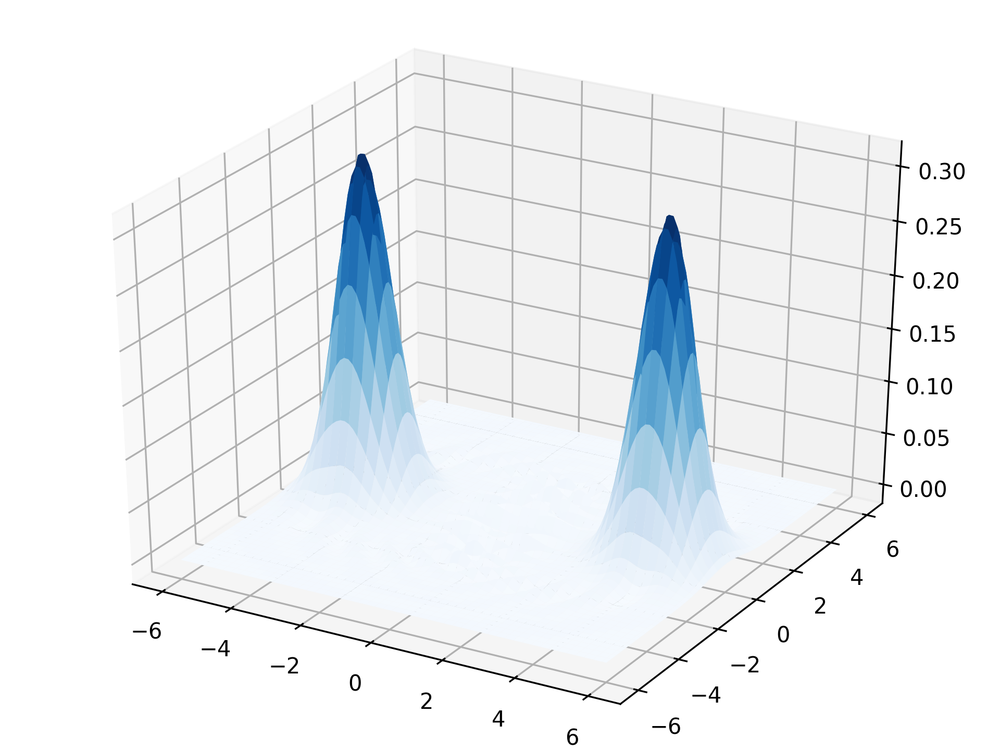

 

<i>|<i>
:---------------:|:---------------:
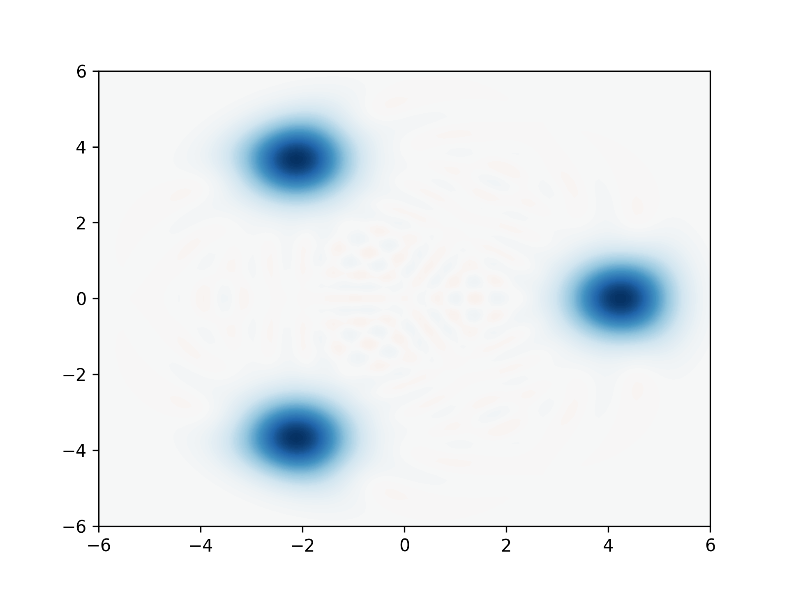|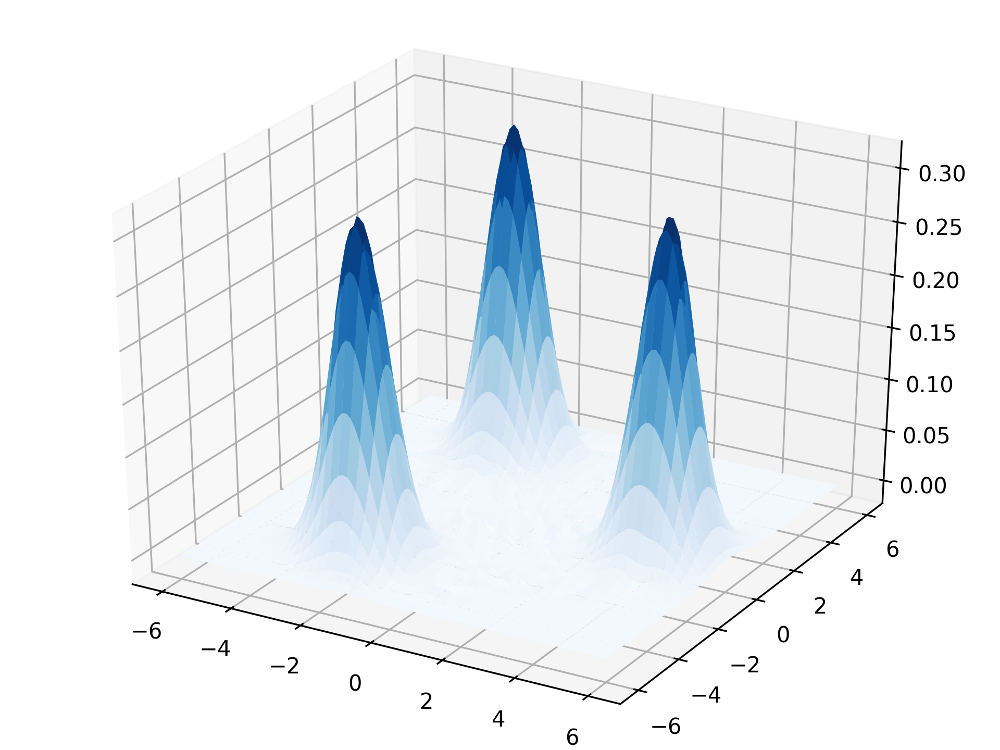

 

<i>|<i>
:---------------:|:---------------:
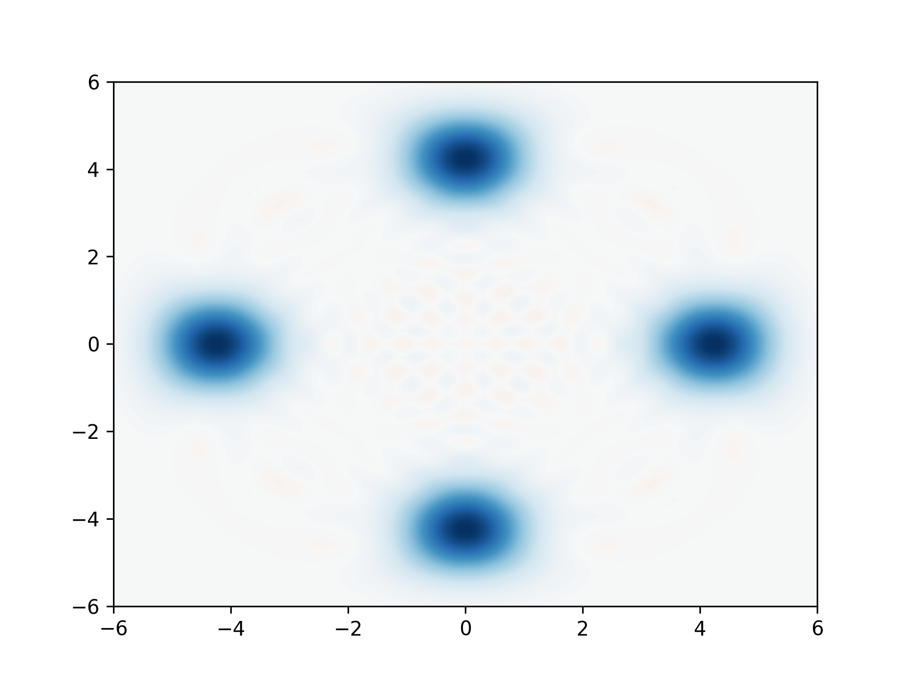|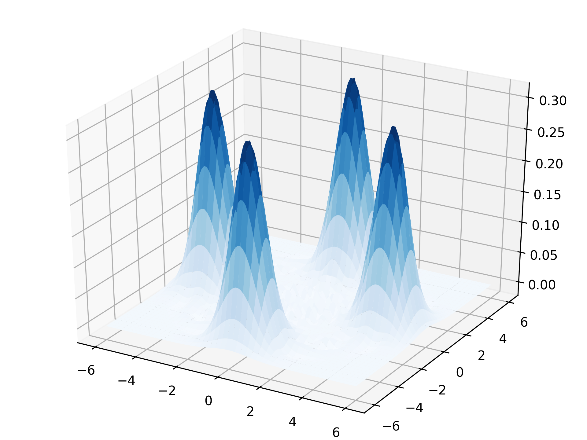
